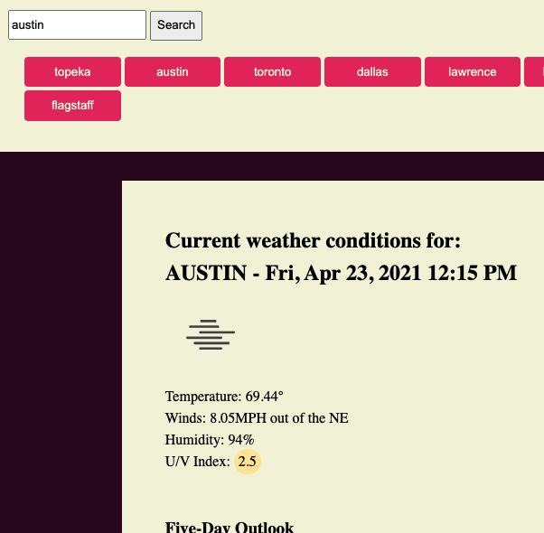

<h1 align="center">
Real-Time Weather
</h1>
    This project challenged me to build a real-time weather dashboard that shows information for a given city.
     
    <!-- TABLE OF CONTENTS -->

  
Table of Contents

  <ol>
    <li>
      <a href="#about-the-project">About The Project</a>
    </li>
    <li><a href="#acknowledgements">Acknowledgements</a></li>
  </ol>

<!-- ABOUT THE PROJECT -->
## About The Project

 
 This project asked me to build a real-time weather application using the open weather API. By inputting a city name the API is called to fetch current and future weather conditions for that city. The elements are then dynamically created on the page, along with search history buttons.

<!-- ACKNOWLEDGEMENTS -->
## Acknowledgements
* Best readme template (https://github.com/othneildrew/Best-README-Template/find/master)

